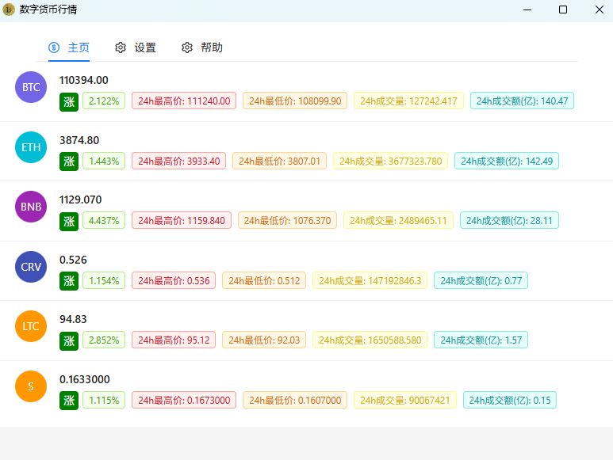

# jcoin-ticker

`jcoin-ticker` 是一个基于 Electron 的桌面盯盘工具，用来展示公开现货行情流中的多币种实时价格和 24 小时统计数据。

## 项目定位

- 面向桌面端使用，而不是普通网页站点
- 默认关注 `USDT` 交易对
- 支持在设置页增删监控币种
- 使用本地存储保存币种配置
- 支持在设置页切换数据源

## 当前功能

- 实时展示币种最新价格
- 展示 24h 涨跌幅、最高价、最低价、成交量和成交额
- 支持多个币种并按配置顺序显示
- WebSocket 断开后自动重连
- 使用 `electron-store` 持久化币种列表
- 支持在设置页配置代理，并让后续网络请求优先走该代理
- 监控币种通过当前数据源的 `USDT` 现货币种列表搜索选择，并带本地缓存与定期刷新
- 代理环境下可按需放行 Binance 证书错误，兼容部分会替换 HTTPS 证书的代理
- 当前支持 `Binance 现货`、`OKX 现货`、`Kraken 现货`、`Coinbase 现货` 四个免 API Key 的公开数据源
- 监控币种列表与首页实时价格统一使用同一个现货数据源，避免出现可选币种与行情源不一致
- 监控币种页面默认优先使用本地缓存，只有首次无缓存或手动刷新时才请求远端币种列表
- 应用后台只维护一个全局现货 WebSocket 运行时，切换页面时不会重复建连
- 首页直接复用后台实时行情状态，收到新价格后会立即刷新，不需要靠切换页面触发更新

## 示例图片



## 技术栈

- Electron
- Vue 3
- TypeScript
- Vite
- Ant Design Vue
- electron-store

## 关键目录

- `src/`：前端界面与页面逻辑
- `electron/`：Electron 主进程与 preload 桥接
- `doc/`：项目文档与示例图片
- `.github/workflows/`：打包与发布流程

更详细的结构说明见：

- `doc/PROJECT_OVERVIEW.md`
- `doc/PROJECT_STRUCTURE.md`
- `AGENTS.md`
- `CHANGELOG.md`

## 开发命令

推荐使用 `pnpm`，当前仓库也已经包含 `pnpm-lock.yaml`。
为兼容 `electron-forge`，仓库已添加 `.npmrc`，默认使用 `node-linker=hoisted`。
为减少国内网络环境下的安装失败，仓库同时配置了以下国内镜像：

- `registry=https://registry.npmmirror.com/`
- `electron_mirror=https://npmmirror.com/mirrors/electron/`

安装依赖后可使用以下脚本：

```bash
pnpm install
pnpm start
```

可用脚本：

```bash
pnpm start    # 推荐开发启动方式：启动 Vite 并拉起 Electron
pnpm dev      # 同 pnpm start
pnpm build    # 类型检查 + 前端构建 + electron-builder 打包
pnpm start:forge  # 直接走 Electron Forge 启动，仅用于特定调试场景
pnpm package  # electron-forge package
pnpm make     # electron-forge make
```

如果你使用 `npm` 或 `yarn`，也可以替换成对应包管理器命令，脚本名称保持一致。

如果你之前已经用其他方式安装过依赖，切换到 `pnpm` 后建议重新安装一次依赖，避免 `node_modules` 结构不一致导致启动异常。
如果 Electron 相关文件下载失败，优先重新执行安装，不要只重试 `pnpm start`。
当前项目的开发链路基于 `vite-plugin-electron/simple`，所以默认应使用 `pnpm start` 或 `pnpm dev`。
`pnpm start:forge` 不会自动提供 Vite dev server，如果没有预先生成 `dist/`，会出现 `dist/index.html` 找不到并导致白屏。

## 数据来源

- Binance Spot WebSocket
- OKX Public Spot WebSocket
- Kraken Spot WebSocket v2
- Coinbase Exchange WebSocket Feed
- Binance 流前缀：
  `wss://data-stream.binance.vision/stream?streams=`
- OKX 公共 WebSocket：
  `wss://ws.okx.com:8443/ws/v5/public`
- Kraken 公共 WebSocket：
  `wss://ws.kraken.com/v2`
- Coinbase 公共 WebSocket：
  `wss://ws-feed.exchange.coinbase.com`
- 每个币种会被拼成 `<coin>usdt@ticker`

## 配置存储

- 存储方案：`electron-store`
- 当前核心配置键：`appConfig`
- 当前结构：

```ts
{
  coins: string[]
  proxy: {
    enabled: boolean
    server: string
    bypassRules: string
    ignoreCertificateErrors: boolean
  }
  marketDataSource: 'binance_spot' | 'okx_spot' | 'kraken_spot' | 'coinbase_spot'
}
```

## 打包与发布

本项目当前同时保留了两套打包相关能力：

- `pnpm build`：使用 `electron-builder`
- `pnpm package` / `pnpm make`：使用 Electron Forge

仓库内还有 GitHub Actions 工作流 `.github/workflows/BuildAndPackage.yml`，用于在打 tag 后执行多平台构建并上传 Release 资产。

## 协作约定

- 变更尽量小而准，优先修改最窄范围
- 能复用现有组件、配置、依赖和工具时，不要重新手写一套
- 不做无关重构，不额外扩功能，不乱发挥
- 文档、代码注释、日志尽量优先使用中文
- 每次有意义的改动都需要同步更新 `CHANGELOG.md`

## 当前已知情况

- `Help` 和 `About` 页面还只是占位内容
- 仓库里暂时没有自动化测试
